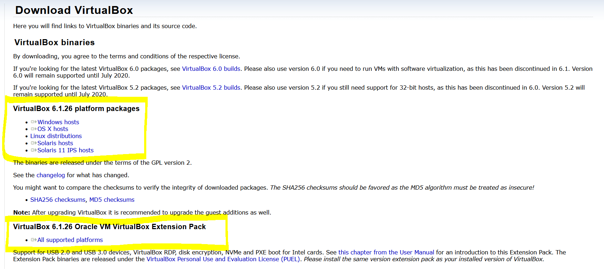
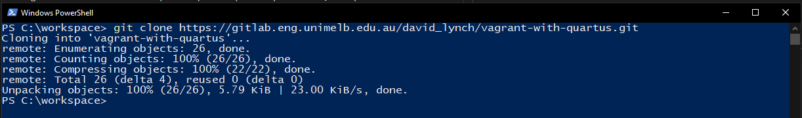

# Vagrant With Quartus

## Description

This Vagrant image is used to generate a Ubuntu virtual machine with Quartus Prime Lite preinstalled.

## Prerequisites

* [VirtualBox (with extensions)](https://www.virtualbox.org/wiki/Downloads "VirtualBox Download Page")
* [Vagrant](https://www.vagrantup.com/downloads "Vagrant Download Page") 
* [Git](https://git-scm.com/downloads "Git Download Page") 
* Memory: 16GB or more recommended (if you have less see notes)
* Hard Drive Space: At least 40GB free space (final intalled size is \approx 30GB)

## Usage
Simply run the respective run script for your operating system:

Windows: 

Linux: ./run_linux.sh

Mac:

Note: This will likely take 1-2 hours (depending on your internet speed). 

# Complete Installation Steps (Windows and Mac)

1. Installing  [Virtualbox](https://www.virtualbox.org/wiki/Downloads "VirtualBox Download Page")

        VirtualBox will be used to run the Ubuntu virtual machine for this. 

        Download and install the hosts package for your personal machine (OS X for Mac, etc)

2. Installing [VirtualBox Extensions](https://www.virtualbox.org/wiki/Downloads "VirtualBox Download Page") 

        Virtualbox extensions will allow us to pass through USB 2.0 devices. This is required for programming the FPGA Development Boards (DE1-SoCs)
        The VirtualBox Extension Pack is also found on the downloads page for VirtualBox. Once VirtualBox is installed, simply double click the package to install.

3. Installing Vagrant

        Vagrant is used to create and configure our virtual machine. 

4. Installing [Git](https://git-scm.com/downloads "Git Download Page") 

        This repository contains the necessary scripts and configurations Vagrant requires to build up the virtual machine. 

5. Downloading this repository

        Find a spot on your computer to clone this repository to. On Windows I use C:\workspace\ and on Linux I use ~\workspace\ - Any sensible location is fine. 

    **Windows** 

    1. Shift+Right Click in the folder that you wish to clone to and click "Open PowerShell window here".
    

    2. Copy and paste `git clone https://gitlab.eng.unimelb.edu.au/david_lynch/vagrant-with-quartus.git` into powershell
    
        

## Contribution

Anyone is welcome to contribute to this project. To do so, clone the local repository to your local workspace, create a git feature branch and request a pull request. Upon review, the pull request will then be accepted or denied.

## Author

David Lynch