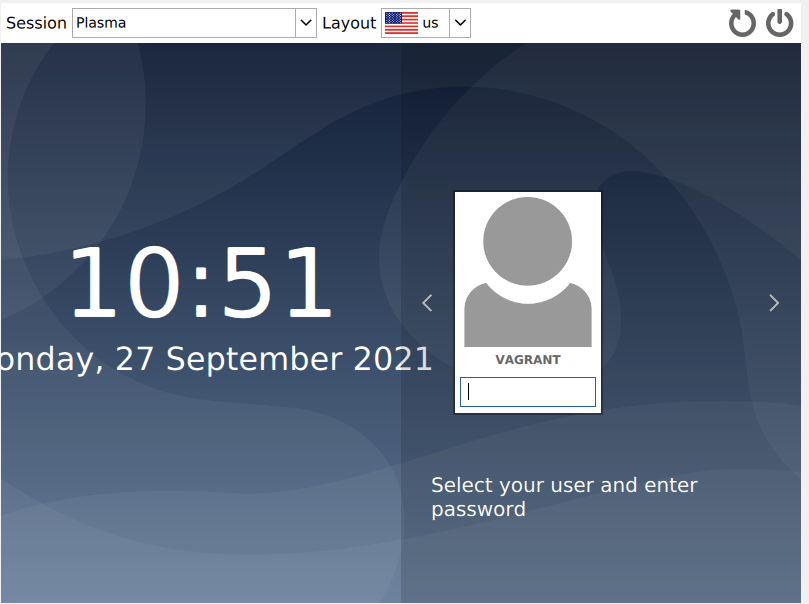
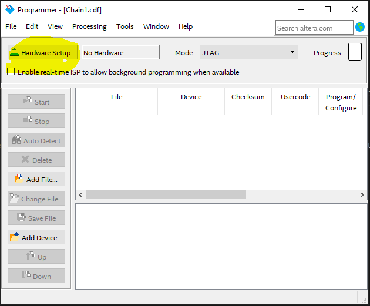
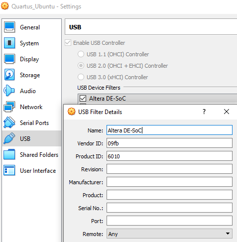

# Vagrant With Quartus

## Description

This is a virtual machine configurator to set up Ubuntu version 20.04 with Quartus Prime Lite edition. The intended audience for this repository is for students of [ELEN20006](https://handbook.unimelb.edu.au/subjects/elen20006). 
This will provide an environment with:
* Quartus Prime Lite edition (Version 20.1)
* Modelsim Starter Edition
* [DESim](https://github.com/fpgacademy/DESim)  (Note: DESim is forked to include Linux compatibility)

If you wish to use your own machine for this class, it is recommended that you use the virtual machine (Quartus does not run on OS X). This makes it easier for the demonstrators to help you as there is unlikely to be any issues with the installation of Quartus.

## Tested working on
Operating System | CPU | Memory
---------|----------|---------
Windows 10      |  Intel i5 (4 cores, 4 threads) | 16GB DDR3 RAM
macOS Big Sur   |  Intel i5 (2 cores, 4 threads) | 8GB LPDDR3 RAM
Arch Linux      | AMD Ryzen (32 cores, 64 threads) | 32GB DDR4 RAM
 

## Prerequisites

* [VirtualBox (with extensions)](https://www.virtualbox.org/wiki/Downloads "VirtualBox Download Page")
* [Vagrant](https://www.vagrantup.com/downloads "Vagrant Download Page") 
* [Git](https://git-scm.com/downloads "Git Download Page") 
* Memory: 4GB  (8GB or more recommended, see step 6 in instructions)
* Hard Drive Space: At least 40GB free space (final installed size is &#8773;  30GB)

## Usage
Once installed, simply type `vagrant reload` in the cloned repository folder in a shell to bring up the virtual machine.

# Complete Installation Steps (Windows and Mac)

1. Install  [Virtualbox](https://www.virtualbox.org/wiki/Downloads "VirtualBox Download Page")

    VirtualBox will be used to run the Ubuntu virtual machine for this. 

    Download and install the hosts package for your personal machine (OS X for Mac, etc)

    **Windows**

    Windows simply download and install the Windows hosts package.

    **Mac** 

    Download and install the OS X hosts package. OS X will ask for a file permission change. Allow this to happen as this is required for the next step.

2. Install [VirtualBox Extensions](https://www.virtualbox.org/wiki/Downloads "VirtualBox Download Page") 

    Virtualbox extensions will allow us to pass through USB 2.0 devices. This is required for programming the FPGA Development Boards (DE1-SoCs)

    The VirtualBox Extension Pack is also found on the downloads page for VirtualBox. Once VirtualBox is installed, simply double click the package to install.

3. Install [Vagrant](https://www.vagrantup.com/downloads "Vagrant Download Page") 

    * Vagrant is used to create and configure our virtual machine. 

    * Download and install Vagrant.

4. Install [Git](https://git-scm.com/downloads "Git Download Page") 

    This repository contains the necessary scripts and configurations Vagrant requires to build up the virtual machine. 

    **Windows**

    Download and install git from the webpage.

    **Mac** 
    
    In spotlight search, type in terminal. Open the terminal, type in git and hit enter. A prompt will appear to install xcode, click yes.

5. Downloading this repository

    Find a spot on your computer to clone this repository to. Any sensible location is fine.

    **Windows**

    1. Create the folder where you want to store this repository. On Windows I use C:\workspace\  

        If you are unsure what to do here. Type PowerShell into your search bar and open powershell. Inside of Powershell type: `mkdir C:\workspace`
        
    2. Shift+Right Click in the folder that you wish to clone to and click "Open PowerShell window here".
        

    3. Copy and paste `git clone https://github.com/dlly11/Vagrant-With-Quartus.git` into powershell and then hit enter (don't close PowerShell).

        

    **Mac**
    
    1. Create the folder where you want to store this repository. On Mac (and Linux) I use ~/workspace/ 

        * If you are unsure what to do here. Type terminal into your search bar and open a terminal. Inside of the terminal type: `mkdir ~/workspace/`

        * **Note**: ~/ corresponds the the home folder in Linux and Mac operating systems. For example, on a Mac if your username was John then ~/Desktop/ = /Users/John/Desktop/

    2.  Open a terminal again from spotlight. You will need to know the path of the folder you created. Assuming you created it in ~/workspace/ - type `cd ~/workspace` and hit enter.

    3. Copy and paste `git clone https://github.com/dlly11/Vagrant-With-Quartus.git` into the terminal and then hit enter (don't close the terminal).
    
6. Configuring your virtual machine (optional)

    * By default, this virtual machine will be assigned 4GB of RAM and 2 CPU cores. 
    * This is an attempt to cater for all students. 
    * If you have &#8805;16GB of memory and &#8805; 4 CPU cores, this is where you have the option of increasing the virtual machines allocation. Increasing the amount of memory is recommended if you can. Increasing the number of CPU cores may help but in my experience 2 is fine for Quartus Lite.

    Inside of the  downloaded folder, there is a file called _Vagrantfile_.

    1. Open the Vagrantfile
    2. There is a line `vb.memory = "4096"` that controls the amount of memory allocated. If you have &#8805;16GB of memory, set this to 8192. If you have 4GB of memory set this to 2048
    3. There is a line `vb.cpus = "2"` that controls the number of CPUs allocated. If you have more than 4 cores / 4 threads then feel free to increase this. I would recommend not going above 4 for stability reasons.

7. Creating the virtual machine

    **NOTE**: THIS NEXT STEP WILL DOWNLOAD 30GB TO 40GB OF FILES, ENSURE YOU HAVE ENOUGH SPACE ON YOUR COMPUTER
    
    1. In the shell/terminal you have been using, type `cd vagrant-with-quartus` and hit enter. If you had closed the terminal/shell then you will have to `cd` into this directory.

    2. In Windows type `.\run_windows.bat`. In Mac type `./run_unix.sh`. This will begin the virtual machine creation. 

    3. Wait. This will likely take hours to build and install all the required software.

8. Once the install process has finished, you should see the following screen in the VirtualBox window:

    
   
   * The password is _vagrant_

9. Check that the system is working.

    * Try opening Quartus. In the bottom left corner of the virtual machine click on the KDE logo. In the search bar type Quartus and open it if it shows up.
    * Try opening Modelsim. Repeat above with Modelsim.
    * Dolphin is the default file explorer in KDE. Open an instance of Dolphin and check if the fpga_gui folder is present. Open it and double click `run.sh`. Did it open the simulator?

## DESim
The DESim is an open source simulator / gui for the DE1-SoC board. This is available on Windows and Linux and you are free to install it directly onto Windows if you wish. It is included in this virtual machine so you can avoid the set up. Here is how to use it:

1. Opening the simulator. 
    On the desktop there should be an icon that called Simulator. If you click on this it should open.

    **NOTE**: If there is no icon on the desktop for this. Nagivate to ~/DESim/ and click in run.sh
2. Running a demo.
   1. Click "Open Project" at the top.
   2. Open the folder ~/DESim/demos/LED_HEX/
   3. Click Compile Testbench
   4. Click Start Simulation
   5. Once the dialog to the left saus "Connected to the simulator" you can start changing the switchs and the push buttons.
3. Running your own code. 
   1. The recommended way to do this is to first create a new folder where you will be testing your code.
   2. Copy the LED_HEX demo files into your new folder.
   3. Modify the file top.v to use your own design rather than the LED_HEX module.
   4. Repeat the steps seen in Running a demo.

Feel free to explore the other demos included. There are some issues with the vga display demos. This may have been fixed in the original git repository.

## Troubleshooting

I ran the installer but the login screen is just text screen saying _login:_
* The installer wasn't able to complete.
    * First, where you ran `run_windows.bat` or `run_unix.sh`, run `vagrant destroy` and confirm. Second, you may have to delete an additional folder. In Windows this folder will be 'C:\Users\\{USERNAME}\VirtualBox VMs\Quartus_Ubuntu'. On Mac this will be '~/VirtualBox VMs/Quartus_Ubuntu'. Go back to step 7 of the installation and try again. Please ensure a stable internet connection.

The Quartus Programmer isn't detecting the DE1-SoC

* There could be multiple causes for this.

    * Make sure the USB cable is not plugged into a USB hub. Plug it directly into your computer. I had this issue multiple times whilst testing this.
    * Try opening and closing hardware setup in the Quartus Programmer a 2-3 times. This often works.

        

    * Check that the USB filter in virtual box is showing up. It should appear as below. If it is not there, you may have opened the virtual machine from VirtualBox. Ensure that the virtual machine is opened through using the command `vagrant reload`

        

## Contribution

Anyone is welcome to contribute to this project. To do so, clone the local repository to your local workspace, create a git feature branch and request a pull request. Upon review, the pull request will then be accepted or denied.

## Author

David Lynch